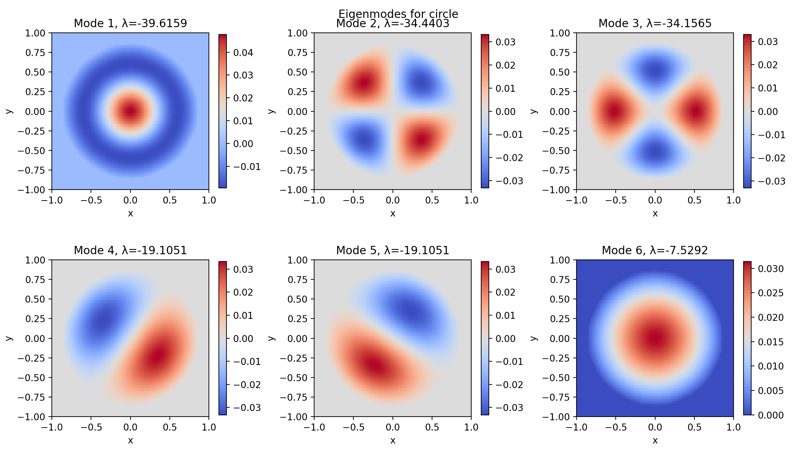

# Spectral Geometry Explorer — "Can You Hear the Shape of a Drum?"

Spectral Geometry Explorer is a Python toolkit for studying the Laplace eigenvalue problem on planar domains. It numerically solves for the vibration modes of "drums" with arbitrary shapes, visualizes their nodal patterns, and can synthesize corresponding audio. The project serves as both a research playground and a portfolio-ready showcase that bridges PDE theory, numerical methods, and interactive visualization.

<p align="center">
  
</p>

## Demo at a Glance

```bash
# 1) Create & activate the virtual environment
python3 -m venv .venv
source .venv/bin/activate

# 2) Install dependencies
pip install -r requirements.txt

# 3) Reproduce the gallery + audio demo
python -m src.app --shape circle --k 6 \
  --save-fig data/domains/circle_modes.png \
  --export-wav data/domains/circle_modes.wav

# 4) Explore the interactive front end
streamlit run src/app.py
```

The CLI command prints the eigenvalue spectrum to the terminal, refreshes the figure in `data/domains/circle_modes.png`, and synthesizes a multi-mode tone at `data/domains/circle_modes.wav`. Swap `--shape` for `l-shape`, `annulus`, or `rectangle` to compare geometries instantly.

## Features
- Finite-difference discretization of the Laplace operator on masked 2D grids
- Sparse eigenvalue solvers powered by SciPy for efficient computation of low-frequency modes
- Modular domain generation (circle, rectangle, polygon, custom image masks)
- Visualization utilities for static plots, animations, and spectral comparisons
- Audio synthesis to "hear" the drum by mapping eigenvalues to audible frequencies
- Optional Streamlit app for interactive exploration of shapes and modes

## Project Layout
```
spectral-drum/
├── data/
│   └── domains/              # Saved binary masks for reference shapes
├── notebooks/
│   ├── analysis.ipynb        # Numerical experiments and comparisons
│   └── theory_notes.ipynb    # Derivations, references, and scratch work
├── src/
│   ├── geometry.py           # Grid generation and domain masks
│   ├── laplacian.py          # Sparse Laplace matrix assembly
│   ├── solver.py             # Eigenvalue problem solvers and utilities
│   ├── visualize.py          # Plotting and animation helpers
│   ├── audio.py              # Sound synthesis from eigenmodes
│   ├── app.py                # Streamlit interface (optional)
│   └── utils.py              # Shared helpers and constants
├── requirements.txt
└── README.md
```

## Quick Start
1. Create and activate a virtual environment.
2. Install dependencies:
   ```bash
   pip install -r requirements.txt
   ```
3. Launch Streamlit (optional): `streamlit run src/app.py`

## Roadmap
- Implement additional domain loaders (SVG contours, bitmap masks)
- Experiment with higher-order finite differences and adaptive meshes
- Explore isospectral pairs and Weyl's law validation
- Investigate connections to graph Laplacians and spectral clustering

## References
- Mark Kac, "Can One Hear the Shape of a Drum?", *The American Mathematical Monthly*, 1966.
- David T. Cheng, *Numerical Methods for Partial Differential Equations*.
- Lloyd N. Trefethen, *Spectral Methods in MATLAB*.

